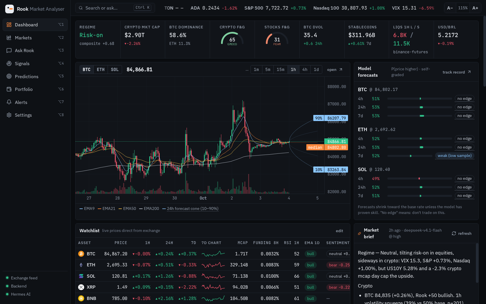
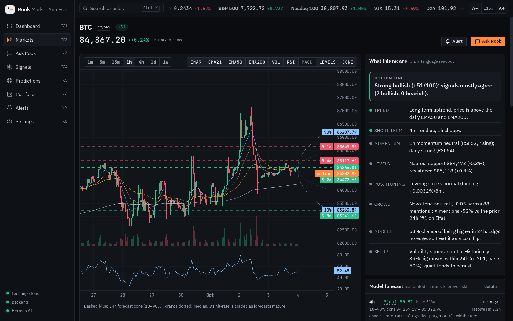

# Rook Market Analyser 🐧

A local-first market-intelligence terminal, **crypto first**, then stocks, macro and fundamentals. It brings together
low-latency live charts, technical analysis, X/Telegram attention data (via [Elfa](https://elfa.ai)), Solana wallet
tracking, graded signal setups and self-grading forecasts. An AI analyst runs on your own models through a
[Hermes Agent](https://hermes-agent.nousresearch.com) API server.

It runs on `127.0.0.1` as a small FastAPI service with a React UI. API keys, wallets, holdings and chats **never leave
your machine**; the only outbound calls are the market-data lookups needed to price them.



## What it does

| | |
|---|---|
| **Live charts** | Your browser streams straight from the exchange WebSocket (Binance → Bybit → OKX), with no backend hop. It measures each venue's real feed latency and uses the fastest venue that lists the pair. EMA 9/21/50/200, RSI, MACD, Bollinger, volume, support/resistance levels, order book and trades. |
| **Plain-language readout** | Every asset opens with a **Bottom line** and short trend / momentum / levels / positioning / crowd / model lines, each tagged positive, negative or neutral. Jargon is underlined and explains itself on hover or keyboard focus. |
| **Signal setups** | 13 causal (no look-ahead) setups: pullbacks in trend, breakouts and breakdowns on volume, squeezes, EMA crosses, RSI divergences, funding and OI extremes. Each comes with its **historical hit rate against the base rate** on that asset and timeframe, plus an honest verdict ("no clear edge" is the most common one). New setups on your watchlist are logged and graded into a live track record. |
| **Forecasts that grade themselves** | P(up) for 4h / 24h / 7d, plus a 10–90% **forecast cone** drawn on the chart. Everything is scored against reality (Brier vs base rate, cone coverage vs the 80% target) and shrunk toward the base rate unless the model has *proven* skill. The cone width recalibrates itself from its own misses. |
| **X / Telegram attention** | Elfa trending tokens, narratives, trending contracts and top mentions. A credit budget paces background jobs to your monthly allowance, keeps a reserve for on-demand lookups and persists results so restarts never re-spend credits. |
| **Solana wallets** | Track any address read-only (SOL, SPL and Token-2022). Prices come from Jupiter with a DexScreener fallback. Spam protection: unverified, illiquid or unpriced tokens are flagged and excluded from totals, and an on-chain token is never mapped to an exchange ticker unless it's the verified mint. Wallets merge into the portfolio (risk, correlation, drawdown); any token can go on the watchlist with its own live chart. |
| **AI analyst** | Ask anything. Each question gets a fresh live-data snapshot, and answers start with a bottom line and a confidence level. The fallback chain is primary model → fallback model (e.g. Gemini 3.8 at max reasoning) → Hermes CLI. If a model fails mid-answer, the next one continues from the cut. The AI's own probability calls are graded too. |
| **Markets & macro** | Stocks and ETFs (incl. B3 `.SA`), SEC fundamentals, US Treasury curve, DXY/VIX/indices, USD/BRL, CNN and crypto Fear & Greed, ETF flows, stablecoin liquidity, funding/OI/long-short, liquidations, on-chain stats, Polymarket, news tone and mindshare from RSS/Reddit. |
| **Alerts** | Write them in plain words or build them from conditions (AND/OR, crosses, cooldowns), with an optional AI explanation when one fires and desktop notifications. |



## Accessibility & readability

- **One size knob**: the whole UI is in `rem`, so a single setting scales everything from 90% to 160% (top-bar **A− / A+** or
  Settings → Display). The default is 115%. Wide tables scroll inside their panel instead of breaking the layout.
- High-contrast theme, reduced-motion mode, WCAG-AA text contrast, visible focus rings, skip link, labelled controls.
- Direction is never shown by colour alone (▲ / ▼).
- A plain-language mode for AI answers, plus "Explain simply" and "What could go wrong?" follow-ups.

## Latency-first by design

- **Browser feeds**: each exchange is probed for event-time → arrival latency, and every symbol streams from the fastest venue
  that lists it. A venue only takes over when it is **>25% faster**, so near-equal venues never flap.
- **Backend chains**: every data family (klines, tickers, prices, RPC…) ranks its sources by an EWMA of latency × failure
  rate, kept fresh by a background prober. Failing sources are skipped for a cooldown, and the next source answers.
- Settings → Latency shows both live.

## Privacy

| Data | Where it lives | Leaves the machine? |
|---|---|---|
| API keys | `~/.config/rookery/secrets.env` (mode 0600) | No. The UI only ever sees "set / not set". |
| Wallet addresses | local SQLite | Only to the Solana RPC that reads the balances. Never sent to an AI, never logged in full, masked in the UI. |
| Holdings & chats | local SQLite | No. By default the AI sees portfolio **weights and percentages only**, not amounts. |
| Name, timezone, home currency | `~/.config/rookery/settings.json` | No |

The server binds to `127.0.0.1` only.

## Install

Requirements: Linux with systemd (for the service; you can also run it by hand), Python 3.14, Node 24+.

```bash
git clone https://github.com/Nicholasvoador/rook-market-analyser.git
cd rook-market-analyser
scripts/install.sh          # venv + deps, build the UI, install + start the user service
scripts/rookery-open        # open it as an app window (or use your app launcher)
```

Or run it by hand:

```bash
cd backend && python3 -m venv .venv && .venv/bin/pip install -r requirements.txt
cd ../frontend && npm ci && npm run build
cd ../backend && .venv/bin/uvicorn rookery.main:app --host 127.0.0.1 --port 8787
```

Everything works **without any keys**. Optional keys go in Settings → API keys:

| Key | Adds |
|---|---|
| `HERMES_API_URL` / `HERMES_API_KEY` | The AI analyst, briefs and plain-language alerts (Hermes Agent API server, `API_SERVER_ENABLED=true`). |
| `ELFA_API_KEY` | X/Telegram mindshare, narratives, trending contracts, top mentions (the free tier is enough; chat needs a paid plan). |
| `SOLANA_RPC_URL` | A private RPC (Helius, QuickNode…) for faster wallet scans. The public mainnet RPC is the default. |
| `COINGECKO_API_KEY`, `CRYPTOPANIC_API_KEY`, `BRAPI_TOKEN` | Higher rate limits and extra news and B3 depth. |

```
service:  systemctl --user {status,restart,stop} rookery
logs:     journalctl --user -u rookery -f
rebuild:  scripts/build.sh
remove:   scripts/install.sh --uninstall      (keeps your data and settings)
dev UI:   cd frontend && npm run dev           (:5173, proxies /api and /ws to :8787)
```

## How the forecasts stay honest

1. **Train** every 6h on ~2 years of hourly bars: trend, momentum, volatility, volume, taker-flow and funding features.
   Base-rate, logistic, gradient-boosting and an online model are combined with purged walk-forward CV. Ensemble weights
   and Platt calibration are learned only from *earlier* folds (prequential), because scoring on the data you fit leaks.
2. **Issue** hourly on closed bars: P(close in h hours > now), plus a 10–90% cone from filtered historical simulation
   (volatility-standardised empirical quantiles, blended toward normal when there are few independent samples).
3. **Shrink** toward the base rate by `clip(skill / 0.01, 0.15, 1) × min(1, n_eff / 200)`. A model without proven skill says
   ~50%, not a confident 35%.
4. **Grade** every forecast when it matures: Brier vs base rate, skill, effective sample size, and cone coverage. The cone
   width adapts online until 80% of outcomes land inside it.
5. **Show the truth**: price-only features show *no edge* at 4h/24h, and the UI says exactly that.

## Architecture

```
Browser (React 19 + lightweight-charts 5, canvas)
 ├── exchange WebSockets direct      latency-ranked venue per symbol; REST poll as last resort
 └── backend /api + /ws  (FastAPI, 127.0.0.1:8787)
       ├── net.py               shared client · TTL cache + in-flight de-dupe · latency-ranked fallback chains · prober
       ├── sources/crypto.py    klines/tickers/markets/derivs/positioning/liquidations/on-chain/ETF/Polymarket
       ├── sources/stocks.py    Yahoo → brapi (B3) → Stooq · SEC EDGAR · US Treasury · CNN F&G · USD/BRL
       ├── sources/sentiment.py RSS + Reddit · VADER + crypto lexicon · ticker detection · mindshare/velocity
       ├── sources/elfa.py      credit-budgeted Elfa client · background jobs · persisted results
       ├── sources/solana.py    RPC chain · SPL + Token-2022 balances · Jupiter · DexScreener · GeckoTerminal
       ├── setups.py            13 causal setup detectors · base-rate stats · pivot levels
       ├── signals.py           Rook score · readout · setup event log + grading
       ├── predict.py           self-grading ensemble · forecast cone · coverage calibration
       ├── wallets.py           read-only wallet tracking · spam/liquidity flags
       ├── portfolio.py         allocation · PnL · vol · correlation · drawdown · risk contribution
       ├── ai.py                live-data context · fallback chain · graded LLM calls
       └── alerts.py            condition engine · AI follow-ups · desktop notifications
```

Data lives in `~/.local/share/rookery/` (SQLite and models); config in `~/.config/rookery/`. Both can be overridden with
`ROOKERY_DATA` / `ROOKERY_CONFIG`.

## Tests

```bash
cd backend && .venv/bin/pip install -r requirements-dev.txt && .venv/bin/python -m pytest -q   # offline, mocked network
cd frontend && npx vitest run
```

The backend suite covers no-look-ahead setups, honest verdicts, cone calibration convergence, latency hysteresis,
fallback chains, Elfa budget pacing and persistence, wallet spam handling, the secrets/wallet privacy guarantees, AI
fallback with mid-answer continuation, and the HTTP API.

A headless browser check (`scripts/e2e/e2e.py`) visits every page at 100%, 115% and 160% scale and fails on console
errors, overflow, clipped controls, unlabelled inputs and missing headings.

---

Research tool, **not financial advice**. Models tell you when they have no edge, so believe them.
